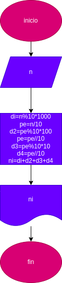

# invertir_numeros_de_4digitos
programa que sirve para invertir numeros de 4 digitos
# INVERTIR NUMEROS
Programa para convertir una cantidad dada de grados centigrados a su equivalente en Farenheit y Kelvin

# Diseño 

## Diagrama de flujo 

